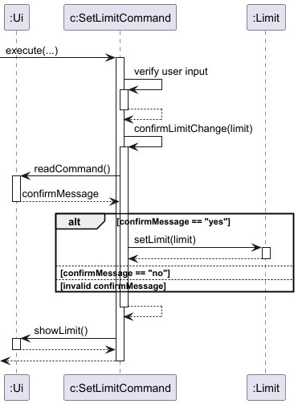
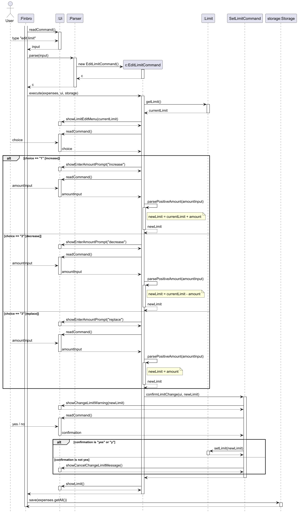
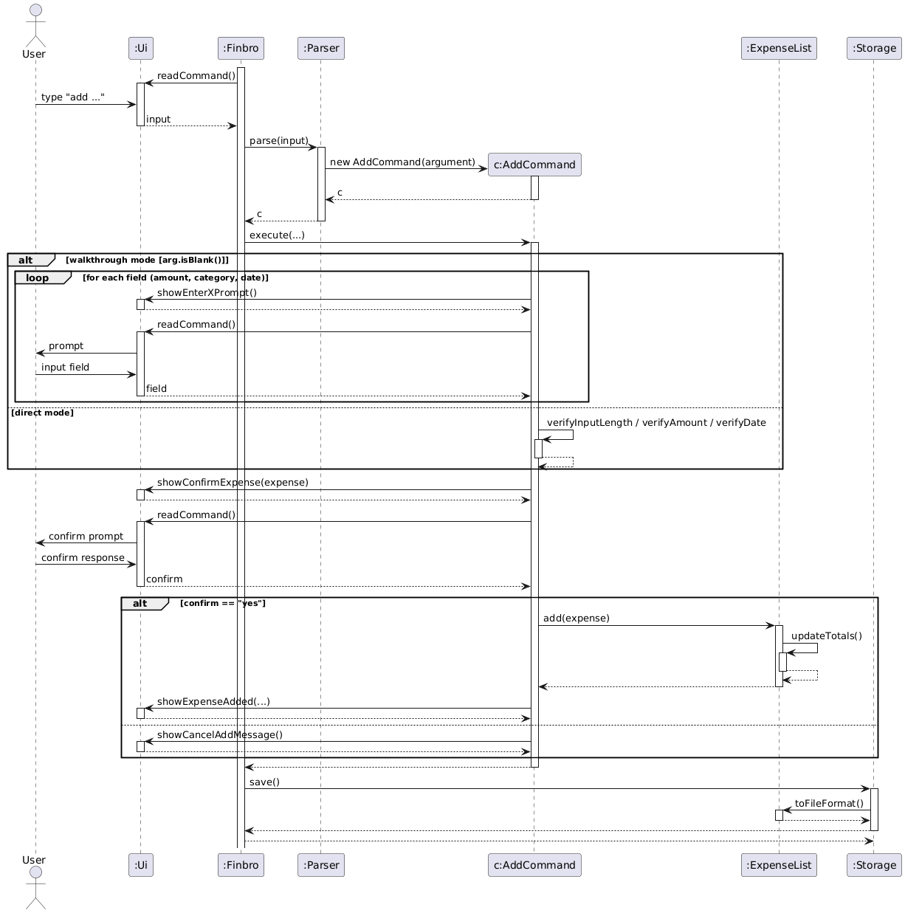

# Developer Guide

## Table of Contents

- [Acknowledgements](#acknowledgements)
- [Design & Implementation](#design--implementation)
  - [Limit Component](#limit-component)
  - [Add Expense Feature](#add-expense-feature)
- [Product Scope](#product-scope)
  - [Target User Profile](#target-user-profile)
  - [Value Proposition](#value-proposition)
- [User Stories](#user-stories)
- [Non-Functional Requirements](#non-functional-requirements)
- [Glossary](#glossary)
- [Instructions for Manual Testing](#instructions-for-manual-testing)

---

## Acknowledgements

*List sources of all reused/adapted ideas, code, documentation, and third-party libraries. Include links to the original source.*

---

## Design & Implementation

### Limit Component

#### Overview

| Component | Responsibility |
|-----------|-----------------|
| **`Limit.java`** | Stores the limit as a static variable accessible across the application. Using a static variable prevents inconsistent limit values and eliminates the need to pass a `Limit` object across class methods. |
| **`SetLimitCommand.java`** | Handles validation and user confirmation logic, improving separation of concerns. |
| **`EditLimitCommand.java`** | Handles the interactive process of modifying an existing monthly spending limit. |

---

#### Setting the Limit

The sequence diagram below illustrates the interaction within the `Limit` component when a user inputs `limit 100`.



**Flow:**

| Step | Action |
|------|--------|
| 1 | **User Input** — The `Ui` receives the input and passes it to `Finbro` |
| 2 | **Parsing** — `Finbro` passes the input to `Parser`, which creates a `SetLimitCommand` object |
| 3 | **Validation & Confirmation** — The command object verifies the user's input limit: If valid, the system requests confirmation from the user. If the user inputs `"yes"`, the limit is updated; otherwise, it remains unchanged |
| 4 | **Display** — `Ui` shows the updated limit |
| 5 | **Persistence** — `Finbro` updates the limit in the `Storage` file |

---

#### Editing the Limit

The sequence diagram below illustrates the interaction within the `Limit` component when a user inputs `edit limit`.



**Flow:**

| Step | Action |
|------|--------|
| 1 | **User Input** — The `Ui` receives the input and passes it to `Finbro` |
| 2 | **Parsing** — `Finbro` passes the input to `Parser`, which creates an `EditLimitCommand` object |
| 3 | **Retrieve Current Limit** — The command object retrieves the current limit from `Limit` |
| 4 | **Edit Menu** — `Ui` displays an edit menu with three options: Increase, Decrease, or Replace the limit |
| 5 | **Amount Entry** — The user enters the corresponding amount |
| 6 | **Validation** — `EditLimitCommand` validates: Must be a valid number, not negative, and if decreasing, must not result in below `$0` |
| 7 | **Confirmation** — If valid, `EditLimitCommand` computes the new limit and calls confirmation logic. If the user inputs `"yes"`, the limit is updated; otherwise, it remains unchanged |
| 8 | **Display** — `Ui` shows the updated limit |
| 9 | **Persistence** — `Finbro` updates the limit in the `Storage` file |

---

### Add Expense Feature

The `add` command records a new expense in the system. It supports two modes of operation:

1. **Direct Mode** — All required parameters are provided in a single command
2. **Walkthrough Mode** — The system interactively prompts the user for input

This dual behavior improves usability by supporting both experienced users (fast entry) and new users (guided input).

---

#### Command Format

**Direct Mode:**
```
add <amount> <category> <date in yyyy-mm-dd>
```

**Walkthrough Mode:**
```
add
```

---

#### Implementation Overview

The `AddCommand` class handles both modes. When executed, the command checks whether arguments were supplied:

- **Arguments present** → Direct mode is executed
- **Arguments absent** → Walkthrough mode is triggered

In both cases, a valid `Expense` object is created and added to the `ExpenseList`. After insertion, the user interface displays a confirmation message and the updated number of expenses.

---

#### Direct Mode

In direct mode, the system parses and validates the input parameters:

| Validation Rule | Requirement |
|-----------------|-------------|
| **Amount** | Must be a positive number |
| **Category** | Must be a non-empty string |
| **Date** | Must follow the required format (`yyyy-mm-dd`) |

**If validation succeeds:**

1. An `Expense` object is created
2. The expense is added to the `ExpenseList`
3. The budget status is updated via the `Limit` component
4. A confirmation message is displayed

---

#### Walkthrough Mode

If the command is issued without parameters, the system enters an interactive mode. The user is sequentially prompted for:

1. Expense amount
2. Expense category
3. Expense date

Each input is validated immediately. Invalid input results in an error message and a repeated prompt until valid data is provided.

**After collecting all inputs:**

- If the user confirms, the expense is added
- Otherwise, the operation is canceled

---

#### Sequence of Operations

The following diagram illustrates the interaction between system components when executing the `add` command in both direct and walkthrough modes.



---

#### Design Considerations

| Principle | Benefits |
|-----------|----------|
| **Single command supporting two modes** | Improves usability by accommodating different user preferences. Avoids duplicating logic across multiple commands. Keeps the command interface simple. |
| **Interactive validation in walkthrough mode** | Ensures invalid data is handled immediately. Reduces the likelihood of user errors. Provides a guided experience for new users. |
| **Separation of concerns** | `Ui` handles user interaction. `Parser` interprets input. `AddCommand` performs application logic. `ExpenseList` manages stored expenses. |

---

#### Limitations

| Limitation | Impact |
|-----------|--------|
| Walkthrough mode requires multiple user inputs | May be slower for experienced users |
| Direct mode requires users to remember the exact command format | Potential for input errors if users don't recall the format |

---

## Product Scope

### Target User Profile

This application is optimized for users who:
- Prefer fast keyboard input over graphical interfaces
- Want to track personal expenses efficiently
- Need quick access to spending patterns and limits

---

### Value Proposition

This application helps users keep track of their spending and provides frequent reminders to prevent unnecessary expenditures.

---

## User Stories

| Version | As a...      | I want to...                                              | So that I can...                                            |
|---------|--------------|-----------------------------------------------------------|-------------------------------------------------------------|
| v1.0    | new user     | see usage instructions                                    | refer to them when I forget how to use the application      |
| v1.0    | new user     | record an expense by providing only amount and category   | start tracking my spending without learning many details    |
| v1.0    | new user     | see clear error messages when I enter invalid inputs      | correct mistakes without frustration                        |
| v1.0    | new user     | view a short help guide explaining available commands     | understand how to use the application                       |
| v1.0    | regular user | record expenses with a description and a date             | have an accurate and meaningful spending history            |
| v1.0    | regular user | be able to delete my expenses                             | remove unnecessary expenses                                 |
| v1.0    | regular user | view total spending by category                           | understand where my money is going                          |
| v1.0    | regular user | set spending limits for a week/month and receive warnings | avoid overspending                                          |

---

## Non-Functional Requirements

- **Performance** — The application should respond to user commands within 1 second under normal load
- **Reliability** — Data should be persisted reliably without loss between sessions
- **Usability** — Commands should be intuitive for users familiar with CLI applications
- **Portability** — The application should run on any platform with Java 11 or higher installed
- **Maintainability** — Code should follow clean architecture principles for easy maintenance and extension

---

## Glossary

- **Expense** — A record of money spent, including amount, category, and date
- **Limit** — A spending threshold set by the user to track budget compliance
- **Direct Mode** — Command execution with all parameters provided upfront
- **Walkthrough Mode** — Interactive command execution with step-by-step prompts

---

## Instructions for Manual Testing

### Loading Sample Data

1. Launch the application
2. Use the `add` command to create sample expenses:
   ```
   add 50.00 Food 2024-01-15
   add 120.00 Transport 2024-01-16
   add 30.50 Entertainment 2024-01-17
   ```
3. Set a spending limit:
   ```
   limit 500
   ```

### Testing Core Features

**Adding Expenses:**
- Test direct mode: `add 25.00 Groceries 2024-01-20`
- Test walkthrough mode: `add` (then follow prompts)
- Test invalid inputs (negative amounts, invalid dates)

**Managing Limits:**
- Set a new limit: `limit 1000`
- Edit the existing limit: `edit limit`
- Test confirmation flows (accept/decline)

**Viewing Data:**
- List all expenses
- View expenses by category
- Check budget status against limit

---
