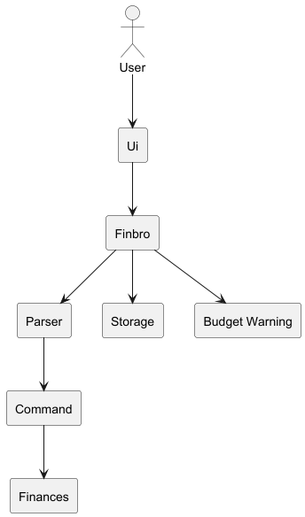
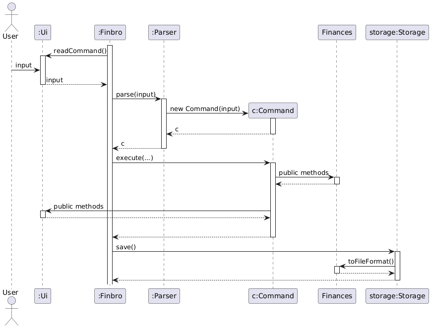
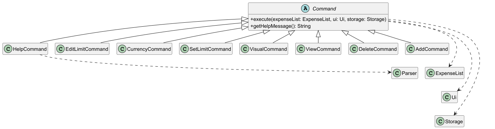
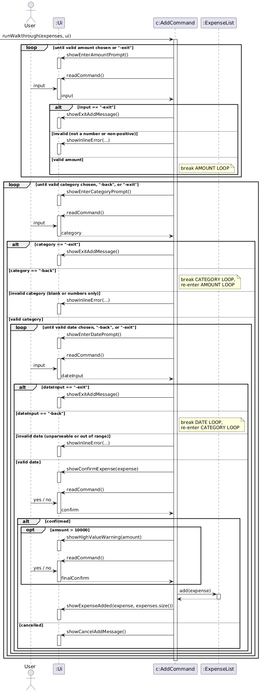
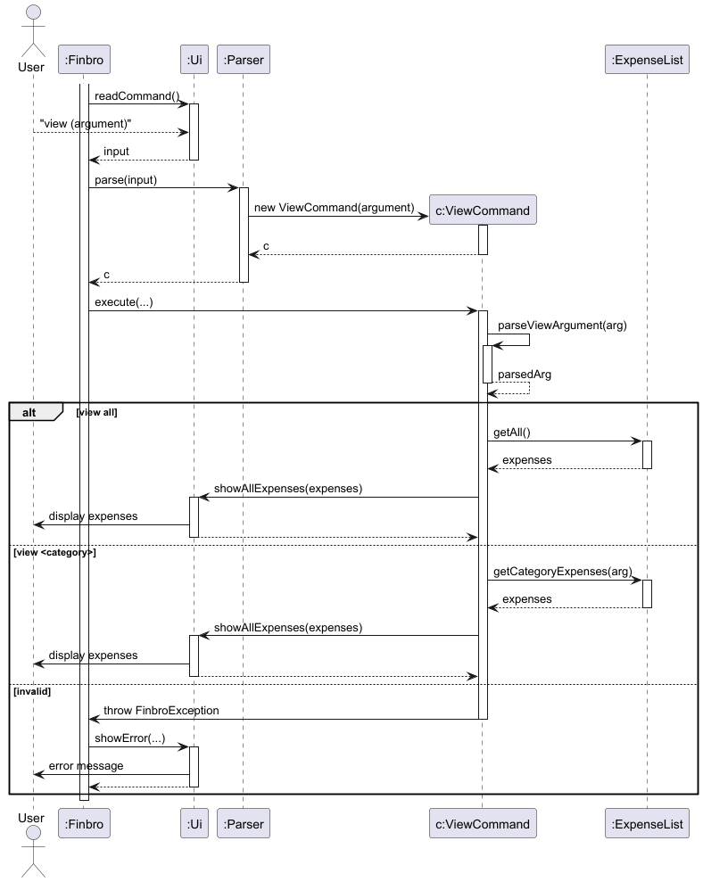
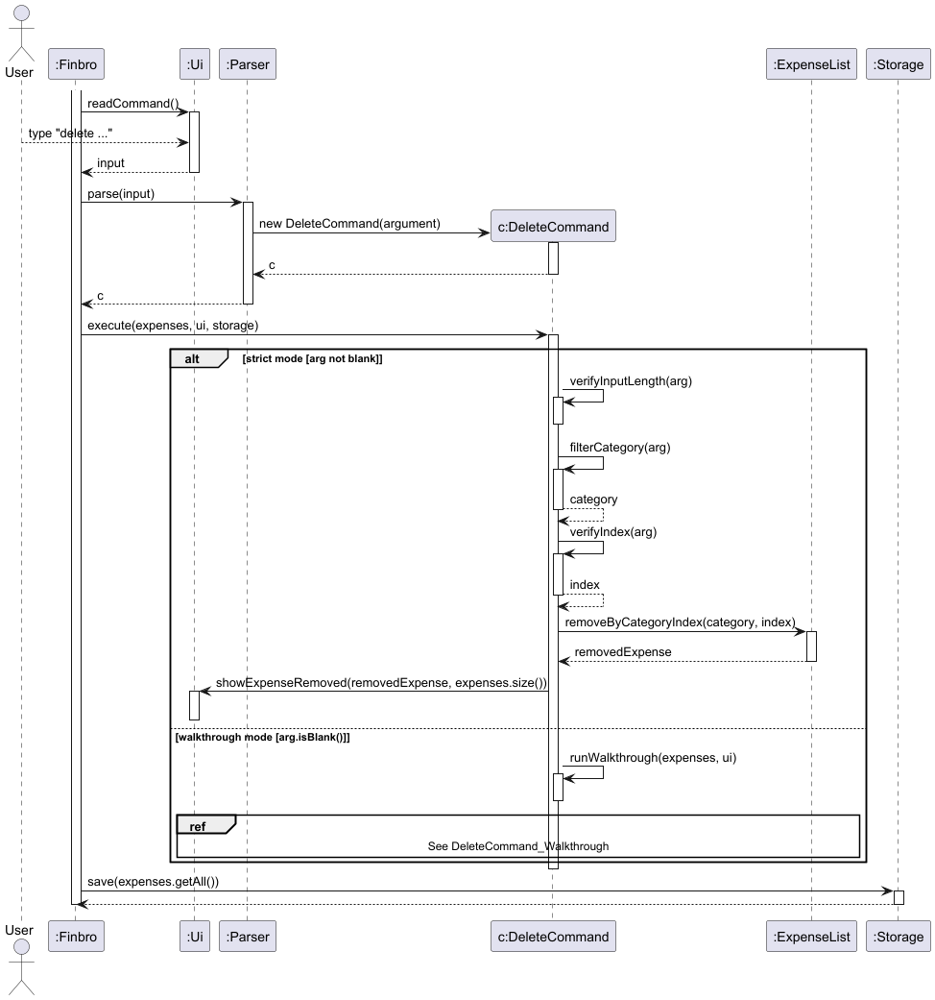
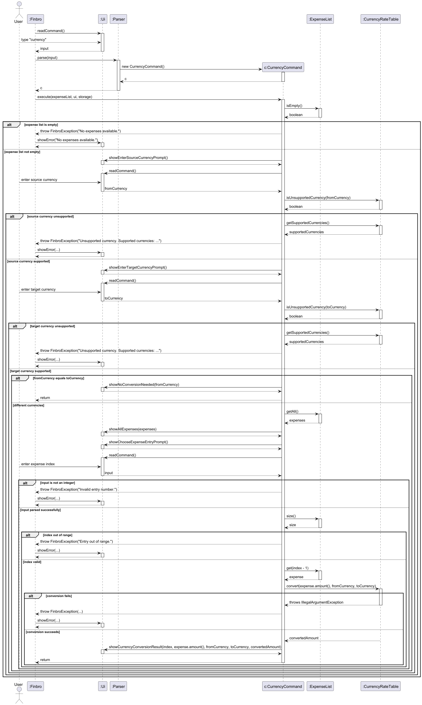
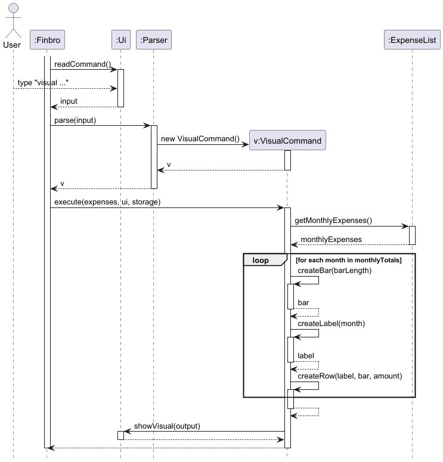

# Developer Guide

## Table of Contents

- [Acknowledgements](#acknowledgements)
- [Design and Implementation](#design-and-implementation) 
    - [Architecture](#architecture)
    - [Limit Feature](#limit-feature)
    - [Add Expense Feature](#add-expense-feature)
    - [View Expense Feature](#view-expense-feature)
    - [Filter and Sort Expense Features](#filter-and-sort-expense-features)
    - [Delete Expense Feature](#delete-expense-feature)
    - [Budget Warning Feature](#budget-warning-feature)
    - [Storage Component](#storage-component)
    - [Currency Exchange Feature](#currency-exchange-feature)
    - [Visualisation Feature](#visualisation-feature)
- [Product Scope](#product-scope)
    - [Target User Profile](#target-user-profile)
    - [Value Proposition](#value-proposition)
- [User Stories](#user-stories)
- [Non-Functional Requirements](#non-functional-requirements)
- [Glossary](#glossary)
- [Instructions for Manual Testing](#instructions-for-manual-testing)

---


## Acknowledgements

This project was developed from the Duke-style command-line application structure. The initial repository setup, Gradle-based project organisation, and documentation skeleton were adapted from the teaching materials used in CS2113.

We also referenced the following SE-EDU resources during development:
- [SE-EDU Java Coding Standards](https://se-education.org/guides/conventions/java/basic.html)
- [Gradle Tutorial](https://se-education.org/guides/tutorials/gradle.html)
- [JUnit Tutorial](https://se-education.org/guides/tutorials/junit.html)
- [Checkstyle Tutorial](https://se-education.org/guides/tutorials/checkstyle.html)

The project uses the following tools and libraries:
- [Gradle](https://gradle.org/) for build automation
- [JUnit 5](https://junit.org/junit5/) for automated testing
- [PlantUML](https://plantuml.com/) for UML diagrams in this Developer Guide

---

## Design and Implementation

### Architecture



#### Main components of the architecture 

| Component          | Responsibility                                                                          | 
|--------------------|-----------------------------------------------------------------------------------------|
| **Ui**             | Handles user input and displays app output                                              | 
| **Finbro**         | Initializes other components in the correct sequence, and connects them with each other |
| **Parser**         | Parses the user's input and initializes the corresponding command object                | 
| **Command**        | Executes user's command                                                                 | 
| **Finances**       | Consists of expenses and the spending limit. Contains the data that the user inputs     | 
| **Storage**        | Reads data from, and writes data to the hard disk                                       | 
| **Budget Warning** | Warns user if expenses is approaching/exceeded the spending limit                       | 


#### How the architecture components interact with each other 



1. User enters command into terminal
2. Ui reads the input and passes it to `Finbro` which calls `parse(input)`
3. `Parser` creates the corresponding `Command` object and returns it to `Finbro` 
4. `Finbro` executes the command object 
5. Changes made to the finances are saved to `Storage` 

---

### Command Component

The command subsystem is organised using an abstract `Command` superclass and multiple concrete subclasses such as
`AddCommand`, `DeleteCommand`, `ViewCommand`, and `HelpCommand`. This allows the parser to return a common `Command`
type while letting each concrete command implement its own execution logic.



#### Design considerations

- Using an abstract `Command` superclass provides a common interface for all commands.
- Each concrete command encapsulates the logic for one user command.
- This improves extensibility, because new commands can be added by introducing another subclass of `Command`.
- Shared execution parameters such as `ExpenseList`, `Ui`, and `Storage` are passed through the `execute(...)` method.

---
### Limit Feature

#### Overview

| Component                   | Responsibility                                                                                                                                                                                             |
|-----------------------------|------------------------------------------------------------------------------------------------------------------------------------------------------------------------------------------------------------|
| **`Limit.java`**            | Stores the limit as a static variable accessible across the application. Using a static variable prevents inconsistent limit values and eliminates the need to pass a `Limit` object across class methods. |
| **`SetLimitCommand.java`**  | Handles validation and user confirmation logic, improving separation of concerns.                                                                                                                          |
| **`EditLimitCommand.java`** | Handles the interactive process of modifying an existing monthly spending limit.                                                                                                                           |

#### Setting the Limit

The sequence diagram below illustrates the interaction within the `Limit` component when a user inputs `limit 100`.


**Flow:**

| Step | Action                                                                                                                                                                                                                          |
|------|---------------------------------------------------------------------------------------------------------------------------------------------------------------------------------------------------------------------------------|
| 1    | **User Input** — The `Ui` receives the input and passes it to `Finbro`                                                                                                                                                          |
| 2    | **Parsing** — `Finbro` passes the input to `Parser`, which creates a `SetLimitCommand` object                                                                                                                                   |
| 3    | **Validation & Confirmation** — The command object verifies the user's input limit: If valid, the system requests confirmation from the user. If the user inputs `"yes"`, the limit is updated; otherwise, it remains unchanged |
| 4    | **Display** — `Ui` shows the updated limit                                                                                                                                                                                      |
| 5    | **Persistence** — `Finbro` updates the limit in the `Storage` file                                                                                                                                                              |

#### Editing the Limit

The sequence diagram below illustrates the interaction within the `Limit` component when a user inputs `edit limit`.


**Flow:**

| Step | Action                                                                                                                                                                                 |
|------|----------------------------------------------------------------------------------------------------------------------------------------------------------------------------------------|
| 1    | **User Input** — The `Ui` receives the input and passes it to `Finbro`                                                                                                                 |
| 2    | **Parsing** — `Finbro` passes the input to `Parser`, which creates an `EditLimitCommand` object                                                                                        |
| 3    | **Retrieve Current Limit** — The command object retrieves the current limit from `Limit`                                                                                               |
| 4    | **Edit Menu** — `Ui` displays an edit menu with three options: Increase, Decrease, or Replace the limit                                                                                |
| 5    | **Amount Entry** — The user enters the corresponding amount                                                                                                                            |
| 6    | **Validation** — `EditLimitCommand` validates: Must be a valid number, not negative, and if decreasing, must not result in below `$0`                                                  |
| 7    | **Confirmation** — If valid, `EditLimitCommand` computes the new limit and calls confirmation logic. If the user inputs `"yes"`, the limit is updated; otherwise, it remains unchanged |
| 8    | **Display** — `Ui` shows the updated limit                                                                                                                                             |
| 9    | **Persistence** — `Finbro` updates the limit in the `Storage` file                                                                                                                     |

#### Implementation Overview 

User input verification: 
- Type: checks if user input can be parsed as a `Double`
- Range: value must be greater than 0 

#### Design considerations 

Proposed Implementation:

The proposed implementation was to allow the user to set the limit only once, so any subsequent changes to the limit 
had to be done using the `edit limit` command. However, on implementation, we found it difficult to keep track of 
whether the limit had already been set between sessions. 

As such, we chose to make `edit limit` an interactive command, where newer users can go through a step-by-step process
to change the spending limit, while advanced users can still reuse the set limit command.

---

### Add Expense Feature

The `add` command records a new expense in the system. It supports two modes of operation:

1. **Direct Mode** — All required parameters are provided in a single command
2. **Walkthrough Mode** — The system interactively prompts the user for input

This dual behaviour improves usability by supporting both experienced users (fast entry) and new users (guided input).

#### Command Format

**Direct Mode:**

```
add <amount> <category> <date in yyyy-mm-dd>
```

**Walkthrough Mode:**

```
add
```

#### Implementation Overview

The `AddCommand` class handles both modes. When executed, the command checks whether arguments were supplied:

- **Arguments present** → Direct mode is executed
- **Arguments absent** → Walkthrough mode is triggered

In both cases, a valid `Expense` object is created and added to the `ExpenseList`. After insertion, the user interface
displays a confirmation message and the updated number of expenses.

#### Direct Mode

In direct mode, the system parses and validates the input parameters:

| Validation Rule | Requirement                                    |
|-----------------|------------------------------------------------|
| **Amount**      | Must be a positive number                      |
| **Category**    | Must be a non-empty string                     |
| **Date**        | Must follow the required format (`yyyy-mm-dd`) |

**If validation succeeds:**

1. An `Expense` object is created
2. The expense is added to the `ExpenseList`
3. The budget status is updated via the `Limit` component
4. A confirmation message is displayed

#### Walkthrough Mode

If the command is issued without parameters, the system enters an interactive mode. The user is sequentially prompted
for:

1. Expense amount
2. Expense category
3. Expense date

Each input is validated immediately. Invalid input results in an error message and a repeated prompt until valid data is
provided.

**After collecting all inputs:**

- If the user confirms, the expense is added
- Otherwise, the operation is canceled

#### Sequence of Operations

The following diagram illustrates the interaction between system components when executing the `add` command in both
direct and walkthrough modes.


#### Walkthrough Mode Sequence

The walkthrough branch of `runWalkthrough(...)` is illustrated separately below. This view focuses on the three
interactive loops (AMOUNT LOOP, CATEGORY LOOP, and DATE LOOP) and the escape keywords (`-back`, `-exit`) that let the
user navigate between, or abort prompts without adding anything.



#### Design Considerations

| Principle                                      | Benefits                                                                                                                                               |
|------------------------------------------------|--------------------------------------------------------------------------------------------------------------------------------------------------------|
| **Single command supporting two modes**        | Improves usability by accommodating different user preferences. Avoids duplicating logic across multiple commands. Keeps the command interface simple. |
| **Interactive validation in walkthrough mode** | Ensures invalid data is handled immediately. Reduces the likelihood of user errors. Provides a guided experience for new users.                        |
| **Separation of concerns**                     | `Ui` handles user interaction. `Parser` interprets input. `AddCommand` performs application logic. `ExpenseList` manages stored expenses.              |

#### Limitations

| Limitation                                                      | Impact                                                      |
|-----------------------------------------------------------------|-------------------------------------------------------------|
| Walkthrough mode requires multiple user inputs                  | May be slower for experienced users                         |
| Direct mode requires users to remember the exact command format | Potential for input errors if users don't recall the format |

---

### View Expense Feature

The `view` command retrieves and displays expenses from the system. It supports two modes of operation:

1. View all expenses — displays every recorded expense
2. View by category — displays only expenses matching the specified category

This dual behaviour allows users to either get a full overview or focus on specific spending categories.

#### Command Format

View all expenses: `view all`

View by category: `view <category>`

#### Implementation Overview

The `ViewCommand` class is responsible for handling both modes. When executed, the command checks the argument supplied:

- If argument is `all` — all expenses are retrieved and displayed
- If argument is a category name — only matching expenses are retrieved and displayed
- If argument is empty — an error is thrown

In both valid cases, a `List<Expense>` is retrieved and passed to `Ui` for display. The total expenditure is calculated
and shown at the end.

#### Sequence of Operations

The following diagram illustrates the interaction between system components when executing the `view` command.



#### Mode: View All

When the user runs `view all`, the system retrieves the full expense list:

1. `ExpenseList.getAll()` returns every stored expense
2. `Ui.showAllExpenses()` iterates through the list and prints each expense
3. The total expenditure is computed and displayed

#### Mode: View by Category

When the user runs `view <category>`, the system filters expenses:

1. `ExpenseList.getCategoryExpenses(arg)` iterates through all expenses and returns only those matching the category
2. If the result is empty, a `FinbroException` is thrown
3. Otherwise, `Ui.showAllExpenses()` displays the filtered list and total

#### Design Considerations

Single command supporting two view modes

- Avoids the need for separate commands for full and filtered views
- Keeps the command interface simple and intuitive
- Reuses the same `showAllExpenses()` method for both modes

Category matching behaviour

- Uses exact string matching via `equals()`
- Ensures predictable and consistent results
- Partial matches are not supported to avoid ambiguous results

Separation of concerns

- `Ui` handles display logic
- `Parser` interprets the input
- `ViewCommand` contains the branching logic
- `ExpenseList` manages data retrieval

#### Limitations

- There is no partial or fuzzy search support
- Users must remember the exact category name used when adding the expense

---

### Filter and Sort Expense Features

The `view` command supports optional filtering and sorting to help users inspect expenses with more control.
This section documents the currently implemented behaviour.

#### Command Format

Supported command forms:

- `view all [-sort <year|month|category|amount>]`
- `view <category> [-filter <month>] [-sort <year|month|amount>]`

Notes:

- `-filter` is only supported for `view <category>`.
- `-sort category` is only supported for `view all`.
- `-filter <month>` accepts full month names and is case-insensitive (e.g., `January`, `january`).

#### Implementation Overview

`ViewCommand` parses the target (`all` or category), then reads optional `-filter` and `-sort` tags.
Execution rules:

- For `view all`, expenses are retrieved with `ExpenseList.getAll()`, then optionally sorted with `SortService`.
- For `view <category>`, expenses are retrieved with `ExpenseList.getCategoryExpenses(category)`.
- If `-filter` is present, `FilterService.filterExpensesByMonth(...)` is applied first.
- If `-sort` is present, sorting is applied after filtering.

Sort behaviour:

- `year`: chronological order
- `month`: chronological order
- `category`: alphabetical order (available only for `view all`)
- `amount`: descending order (highest to lowest)

Error handling is done through `FinbroException` for invalid formats, unsupported tag combinations, invalid sort types,
invalid month values, or unknown categories.

#### Sequence of Operations

The following diagram shows how the command is parsed, validated, optionally filtered/sorted, and displayed:


#### Behaviour by Mode

For `view <category> -filter <month>`:

1. Parse the month input and validate it
2. Filter the expenses in the specified category by the given month
3. Optionally apply `-sort <year|month|amount>` if provided
4. Display the resulting list via `Ui.showAllExpenses(...)`
5. Throw an error if the month is invalid (must be full month name)

For `view all -sort <type>`:

1. Retrieve all expenses
2. Sort by `year`, `month`, `category`, or `amount`
3. Display the sorted list
4. Throw an error if `type` is invalid

For `view <category> [-filter <month>] -sort <type>`:

1. Retrieve category expenses
2. Optionally apply month filter
3. Sort by `year`, `month` or `amount`
4. Throw an error if `type` is `category`

#### Design Considerations

| Principle                                                | Benefits                                                              |
|----------------------------------------------------------|-----------------------------------------------------------------------|
| **Single command with optional tags**                    | Keeps usage compact while allowing advanced query behaviour.          |
| **Service-based logic (`FilterService`, `SortService`)** | Improves separation of concerns and testability.                      |
| **Validation before execution**                          | Fails fast on invalid formats/types and prevents ambiguous behaviour. |

#### Limitations

| Limitation                                | Impact                                                |
|-------------------------------------------|-------------------------------------------------------|
| Optional tags increase command complexity | Users must remember valid tag combinations.           |
| Category matching remains exact           | Typos or non-matching category names return an error. |

---

### Delete Expense Feature

The `delete` command removes an existing expense from the system. It supports two modes of operation:

1. **Direct Mode** — The category and expense number are provided in a single command
2. **Walkthrough Mode** — The system interactively prompts the user for the required input

This dual behaviour improves usability by supporting both experienced users (fast deletion) and new users (guided
deletion).

#### Command Format

**Direct Mode:**

```
delete <category> <number>
```

**Walkthrough Mode:**

```
delete
```

#### Implementation Overview

The `DeleteCommand` class handles both modes. When executed, the command checks whether arguments were supplied:

- **Arguments present** → Direct mode is executed
- **Arguments absent** → Walkthrough mode is triggered

In direct mode, the target expense is validated and removed immediately. In walkthrough mode, the system first guides
the user through selecting an expense, then removes it only if the user confirms the deletion. After a successful
deletion, the user interface displays a confirmation message and the updated number of expenses.

#### Direct Mode

In direct mode, the system parses and validates the input parameters:

| Validation Rule    | Requirement                                |
|--------------------|--------------------------------------------|
| **Category**       | Must refer to an existing expense category |
| **Expense Number** | Must be a valid positive integer           |
| **Command Format** | Must follow `delete <category> <number>`   |

**If validation succeeds:**

1. The category is extracted from the command
2. The expense number is parsed and validated
3. The corresponding expense is removed from the `ExpenseList`
   . A confirmation message is displayed

#### Walkthrough Mode

If the command is issued without parameters, the system enters an interactive mode. The user is sequentially prompted
for:

1. Expense category
2. Expense number within that category
3. Deletion confirmation

Each input is validated before proceeding. Invalid input results in an error message and a repeated prompt until valid
data is provided.

**Escape keywords** (all case-insensitive) allow the user to navigate or abort the walkthrough at any prompt:

- `-l` — lists all categories (at the category prompt) or all expenses in the current category (at the index prompt).
- `-back` — available only at the index prompt. Returns the user to the category prompt so they can re-choose a different category without cancelling the delete operation.
- `-exit` — available at both prompts. Calls `Ui#showExitDeleteMessage()` and returns from `runWalkthrough` immediately, cancelling the delete operation.

The walkthrough is implemented as an outer `while(true)` loop wrapping the CATEGORY LOOP and INDEX LOOP. `-exit`
triggers an early `return` from `runWalkthrough`, while `-back` `break`s out of the INDEX LOOP so the outer loop
re-enters the CATEGORY LOOP with a fresh category state.

**After collecting all inputs:**

- If the user confirms, the expense is deleted and `Ui#showExpenseRemoved(...)` is called.
- Otherwise, `Ui#showCancelDeleteMessage()` is called.


**After collecting all inputs:**

- If the user confirms, the expense is deleted
- Otherwise, the operation is canceled

#### Sequence of Operations

The following diagram illustrates the interaction between system components when executing the `delete` command.
It shows the initial parsing, the direct-mode path in detail.



#### Walkthrough Mode Sequence

The walkthrough branch of `runWalkthrough(...)` is illustrated separately below. This view focuses on the two
interactive loops (CATEGORY LOOP and INDEX LOOP) and the escape keywords (`-l`, `-back`, `-exit`) that let the
user list, navigate between, or abort prompts without deleting anything.


#### Design Considerations

| Principle                               | Benefits                                                                                                                                               |
|-----------------------------------------|--------------------------------------------------------------------------------------------------------------------------------------------------------|
| **Single command supporting two modes** | Improves usability by accommodating different user preferences. Avoids duplicating logic across multiple commands. Keeps the command interface simple. |
| **Confirmation in walkthrough mode**    | Reduces the risk of accidental deletion. Gives users a final chance to verify the selected expense before removal.                                     |
| **Separation of concerns**              | `Ui` handles user interaction. `Parser` interprets input. `DeleteCommand` performs deletion logic. `ExpenseList` manages stored expenses.              |

#### Limitations

| Limitation                                                                 | Impact                                                                       |
|----------------------------------------------------------------------------|------------------------------------------------------------------------------|
| Walkthrough mode requires multiple user inputs                             | May be slower for experienced users                                          |
| Direct mode requires users to know the correct category and expense number | Potential for input errors if users do not remember the exact item to remove |
| Direct mode does not include a confirmation step                           | Incorrect input may lead to immediate deletion                               |

---

### Budget Warning Feature

`BudgetWarningService` checks the current budget state and shows warnings when spending is close to, or above, the
configured monthly limit.

#### Warning Levels

Warnings are evaluated only when both conditions are true:

- The calling `Command` indicates budget checks should run (`checksBudget == true`)
- `Limit.getLimit() != 0`

If either condition is false, no warning is shown.

Warnings are computed based on the **current month** total expenditure:

- `monthlyTotal = ExpenseList.getCurrentMonthTotalExpenditure()`
- `remaining = limit - monthlyTotal`

| Warning Level   | Threshold Condition | User Feedback                            |
|-----------------|---------------------|------------------------------------------|
| **Safe**        | `remaining > 20`    | No warning is displayed.                 |
| **Approaching** | `remaining <= 20`   | `Ui.showBudgetReminder(limit)` is shown. |
| **Exceeded**    | `monthlyTotal > limit` | `Ui.showBudgetExceeded(limit)` is shown. |

#### Implementation Overview

`Finbro.run()` invokes `budgetWarningService.checkAndShowWarnings(expenses, ui, checksBudget)`:

- Once on startup with `checksBudget == true`
- After each successful command execution with `checksBudget == command.checksBudget()`

Inside `checkAndShowWarnings(...)`, the service:

1. Reads `monthlyTotal` from `ExpenseList.getCurrentMonthTotalExpenditure()`
2. Reads `limit` from `Limit.getLimit()`
3. Applies threshold checks (`monthlyTotal > limit`, else `limit - monthlyTotal <= 20`) and triggers the corresponding
   `Ui` warning method when needed

#### Sequence of Operations

The following diagram illustrates the interaction between system components when the budget warning is evaluated.


#### Design Considerations

| Principle                  | Benefits                                                                                                                      |
|----------------------------|-------------------------------------------------------------------------------------------------------------------------------|
| **Continuous feedback**    | Budget status is checked every run-loop iteration, so users are reminded regularly while the app is running.                  |
| **Clear thresholds**       | Distinct warning levels help users understand how close they are to their limit and encourage proactive financial management. |
| **Separation of concerns** | The warning logic is encapsulated in a dedicated service, keeping it separate from the core expense management logic.         |
| **User-friendly messages** | Feedback is designed to be informative and actionable, guiding users to review their spending habits.                         |

#### Limitations

| Limitation                                                                  | Impact                                                                                                          |
|-----------------------------------------------------------------------------|-----------------------------------------------------------------------------------------------------------------|
| Warnings are shown at loop time, not only after specific mutating commands  | The same warning may be repeated across multiple prompts until expenses or limit change.                        |
| Thresholds are fixed (`20` buffer and strict `remaining < 0` exceeded rule) | Users cannot customize sensitivity, and exact-limit (`remaining == 0`) is treated as approaching, not exceeded. |

---

### Storage Component

The `Storage` class is responsible for persisting expense data and the budget limit across sessions. It reads from and
writes to a local `.txt` file.

#### Load Operation

When the application starts, `Storage.load()` is called:

1. If the file does not exist, an empty list is returned and a new file will be created on the next save
2. The first line is passed to `readLimit()` which checks for the `LIMIT | <value>` format and sets the budget limit via
   `Limit.setLimit()`
3. If the first line is not a limit entry, it is treated as an expense line instead.
   Each subsequent line is passed to `processExpenseLine()` which splits by `|` and validates the format and amount
   before adding to the list
4. Corrupted or malformed lines are logged and skipped without crashing the application

#### Save Operation

After every command, `Storage.save()` is called:

1. The budget limit is written first in the format `LIMIT | <value>`
2. Each expense is written in the format `amount | category | date`
3. The file and its parent directories are created automatically if they do not exist

#### File Format

The `finbro.txt` file follows this structure:

LIMIT | 1000.00
50.00 | food | 2026-03-01
20.00 | transport | 2026-03-02

#### Design Considerations

Corruption handling

- Malformed lines are skipped rather than throwing an exception
- Ensures a single corrupted entry does not affect the rest of the data
- All skipped lines are logged at WARNING or SEVERE level for debugging

Limit stored as first line

- Separating the limit from expense entries allows it to be read and applied before any expenses are processed
- Falls back gracefully if no limit line is found

Flat file over a database

- Keeps the application lightweight with no external dependencies
- Sufficient for the scale of data this application handles

---

### Currency Exchange Feature

The `currency` command allows users to convert the amount of a selected expense from one currency to another. It follows
an interactive workflow where users specify the source currency, target currency, and the expense entry to convert.

This feature operates entirely offline using predefined exchange rates stored in the system.

```
currency
```

#### Implementation Overview

The `CurrencyCommand` class manages the full workflow of currency conversion. It interacts with the following
components:

| Component               | Responsibility                                                |
|-------------------------|---------------------------------------------------------------|
| **`CurrencyCommand`**   | Handles user interaction, validation, and conversion workflow |
| **`CurrencyRateTable`** | Stores exchange rates and performs conversion logic           |
| **`ExpenseList`**       | Provides access to stored expenses                            |
| **`Ui`**                | Handles user input and output display                         |

#### Currency Conversion Logic

The `CurrencyRateTable` uses **SGD as the base currency**. All exchange rates are defined relative to SGD.

Conversion follows these rules:

| Case             | Logic                  |
|------------------|------------------------|
| Same currency    | Return original amount |
| From SGD         | `amount * rate`        |
| To SGD           | `amount / rate`        |
| Other currencies | Convert via SGD        |

Note that currency conversion in the current implementation is **non-destructive**: it displays the converted amount
but does not modify the stored expense entry or persist a currency value to storage.

#### Sequence Diagram

The following diagram illustrates the interaction between system components when executing the `currency` command.


#### Design Considerations

| Principle                  | Benefits                                                 |
|----------------------------|----------------------------------------------------------|
| **Interactive workflow**   | Easier for users; no need to memorise command syntax     |
| **Separation of concerns** | Conversion logic isolated in `CurrencyRateTable`         |
| **Base currency approach** | Reduces complexity and avoids storing all currency pairs |
| **Offline capability**     | No dependency on APIs or internet                        |
| **Logging support**        | Improves debugging and traceability                      |

#### Error Handling

The system validates multiple error conditions:

| Error Case            | Behaviour                        |
|-----------------------|----------------------------------|
| No expenses available | Throws `FinbroException`         |
| Unsupported currency  | Displays supported currency list |
| Invalid entry number  | Throws `FinbroException`         |
| Entry out of range    | Throws `FinbroException`         |

---

### Visualisation Feature

The `visual` command creates a bar graph of the user's spendings arranged by month. 

#### Sequence of operations 



Flow:

| Step | Action                                                               | 
|------|----------------------------------------------------------------------| 
| 1    | `Finbro` calls execute on `VisualCommand` object                     | 
| 2    | The command object gets the monthly expenses and sorts them by month | 
| 3    | Assembles the bar chart and assembles into an output string          | 
| 4    | Passes the output to `Ui` which shows it to the user                 | 

#### Implementation overview 

Sorting: 

- `getMonthlyExpenses()` returns a `Map` with the year and month as the key, and the amount as the value
- `VisualCommand` places the output in a `TreeMap` which will sort the expenses by key (year and month)

Bar graph construction: 

- Bar graph is constructed using the full block Unicode character - █
- The month with the largest expense is set to have `MAX_BAR_LENGTH` number of bars 
- Other months will have a number of bars roughly equal to its proportion of the largest monthly expense

[Proposed] Filter date range
- Allow user to input a start and/or end year and month to narrow the date range of the bar graph 
- Read additional optional arguments headed by `/by` and `/to` for start and end dates 
- Only add expenses to the `TreeMap` if they are within the date range 

## Product Scope

### Target User Profile

This application is optimized for users who:

- Prefer fast keyboard input over graphical interfaces
- Want to track personal expenses efficiently
- Need quick access to spending patterns and limits

---

### Value Proposition

This application helps users keep track of their spending and provides frequent reminders to prevent unnecessary
expenditures.

---

## User Stories

| Version | As a...          | I want to...                                              | So that I can...                                         |
|---------|------------------|-----------------------------------------------------------|----------------------------------------------------------|
| v1.0    | new user         | see usage instructions                                    | refer to them when I forget how to use the application   |
| v1.0    | new user         | record an expense by providing only amount and category   | start tracking my spending without learning many details |
| v1.0    | new user         | see clear error messages when I enter invalid inputs      | correct mistakes without frustration                     |
| v1.0    | new user         | view a short help guide explaining available commands     | understand how to use the application                    |
| v1.0    | regular user     | record expenses with a description and a date             | have an accurate and meaningful spending history         |
| v1.0    | regular user     | be able to delete my expenses                             | remove unnecessary expenses                              |
| v1.0    | regular user     | view total spending by category                           | understand where my money is going                       |
| v1.0    | regular user     | set spending limits for a week/month and receive warnings | avoid overspending                                       |
| v2.0    | new user         | go through a walkthrough when adding expenses             | navigate the system without dealing with many errors     |
| v2.0    | new user         | go through a walkthrough when deleting expenses           | navigate the system without dealing with many errors     |
| v2.0    | regular user     | view expenses filtered by month                           | narrow expenses within a time range                      | 
| v2.0    | regular user     | view expenses that are sorted by amount                   | keep track of my largest expenses                        | 
| v2.0    | regular user     | view a bar chart showing my monthly expenses              | better visualize my spendings over different months      |
| v2.0    | exchange student | convert my existing expenses from SGD to another currency | keep track of expenses using my own local currency       | 

---

## Non-Functional Requirements

- **Performance** — The application should respond to user commands within 1 second under normal load
- **Reliability** — Data should be persisted reliably without loss between sessions
- **Usability** — Commands should be intuitive for users familiar with CLI applications
- **Portability** — The application should run on any platform with Java 17 or higher installed
- **Maintainability** — Code should follow clean architecture principles for easy maintenance and extension

---

## Glossary

- **Expense** — A record of money spent, including amount, category, and date
- **Limit** — A spending threshold set by the user to track budget compliance
- **Direct Mode** — Command execution with all parameters provided upfront
- **Walkthrough Mode** — Interactive command execution with step-by-step prompts

---

## Instructions for Manual Testing

### Loading Sample Data

1. Launch the application
2. Use the `add` command to create sample expenses:
   ```
   add 50.00 Food 2026-01-15
   add 120.00 Transport 2026-01-16
   add 30.50 Entertainment 2026-01-17
   ```
3. Set a spending limit:
   ```
   limit 500
   ```

### Testing Core Features

**Adding Expenses:**

- Test direct mode: `add 25.00 Groceries 2026-01-20`
- Test walkthrough mode: `add` (then follow prompts)
- Test invalid inputs (negative amounts, invalid dates)

**Managing Limits:**

- Set a new limit: `limit 1000`
- Edit the existing limit: `edit limit`
- Test confirmation flows (accept/decline)

**Viewing Data:**

- List all expenses
- View expenses by category/date
- Check budget status against limit
- View visualization: `visual`

---
