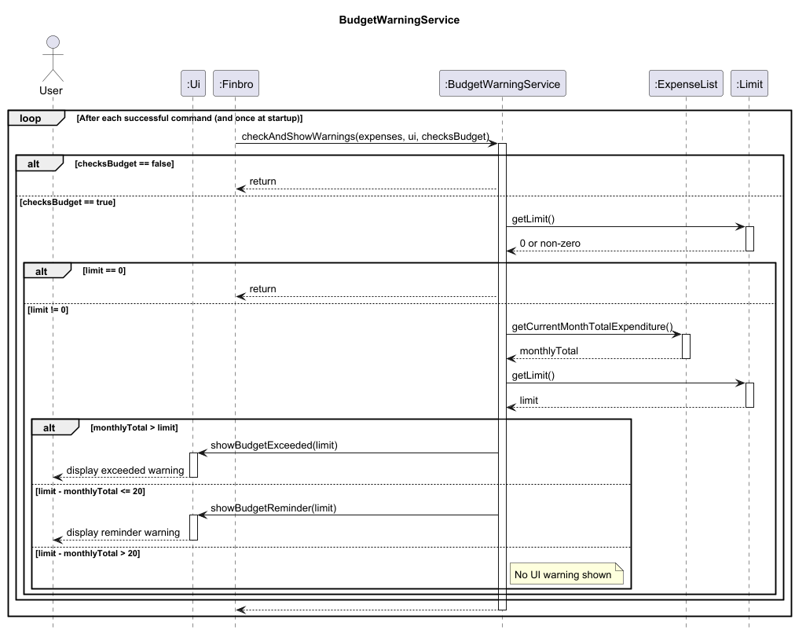
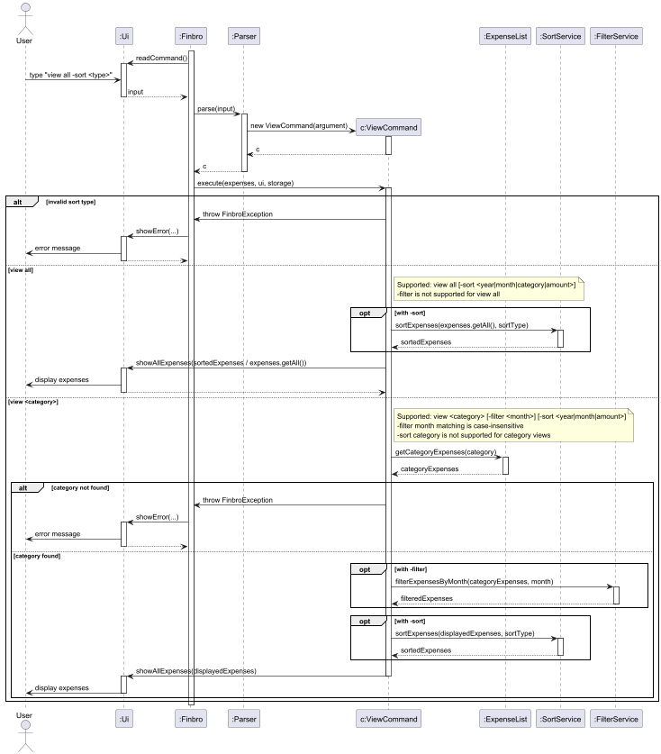
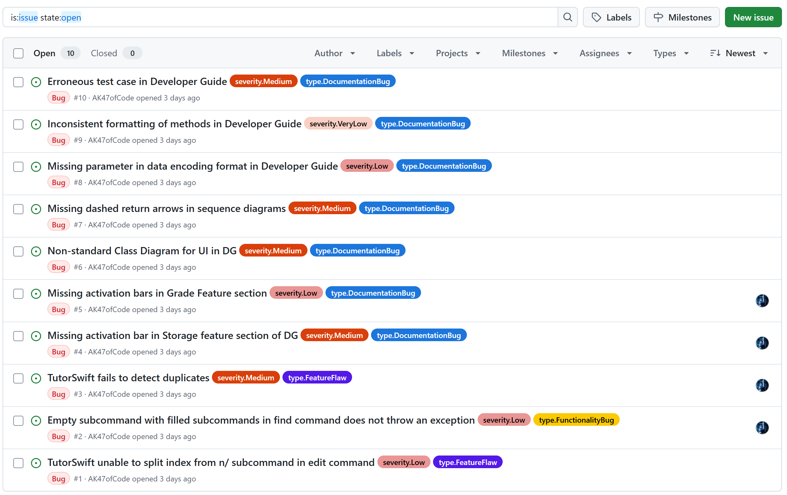
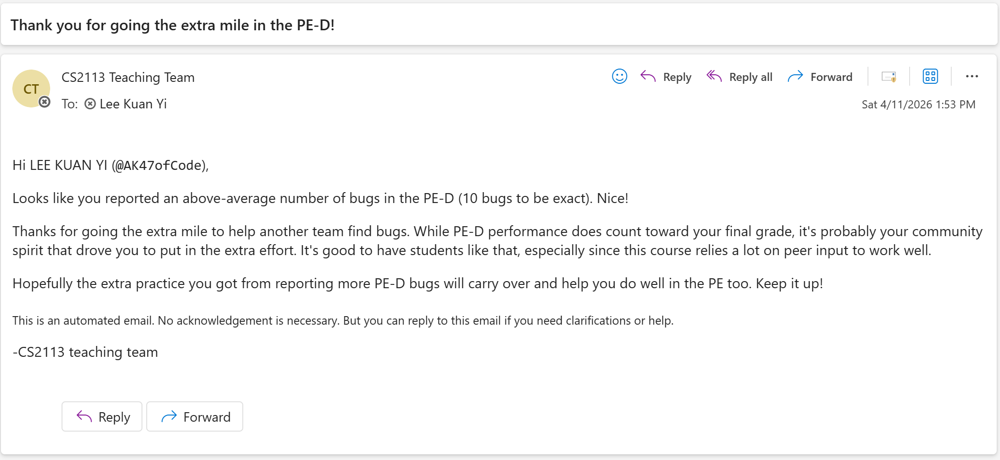

# Lee Kuan Yi - Project Portfolio Page

## Overview

**Finbro** is a command-line personal finance tracker designed to help users manage their expenses efficiently. It
allows users to record expenses, monitor spending habits, set financial limits, and perform currency conversions.

My contributions focused on enhancing usability and flexibility through the implementation of the **Filter Expenses by
Month**, **Sort Expenses**, and **Budget Reminder System** features. These improvements make the application more
intuitive and user-friendly by allowing users to manage their expenses more effectively and gain better insights into 
their spending habits.

---

## Code Contributions

**RepoSense Link:**  
[View detailed code contributions](https://nus-cs2113-ay2526-s2.github.io/tp-dashboard/?search=AK47ofCode&breakdown=true&sort=groupTitle%20dsc&sortWithin=title&since=2026-02-20T00%3A00%3A00&timeframe=commit&mergegroup=&groupSelect=groupByRepos&checkedFileTypes=docs~functional-code~test-code~other&filteredFileName=&tabOpen=true&tabType=authorship&tabAuthor=AK47ofCode&tabRepo=AY2526S2-CS2113-T10-4%2Ftp%5Bmaster%5D&authorshipIsMergeGroup=false&authorshipFileTypes=docs~functional-code~test-code&authorshipIsBinaryFileTypeChecked=false&authorshipIsIgnoredFilesChecked=false)

---

## Core Features Implemented

### 1. Budget Reminder System

* Implemented a **Budget Reminder System** that monitors user expenses against a predefined monthly budget limit.
* The system checks the total expenses after each addition and sends reminders when certain thresholds are reached:
    * **$20 difference from the budget limit**: Sends a warning that the user is approaching their budget limit.
    * **100% or more of the budget limit**: Sends an alert that the user has reached or exceeded their budget limit.
* The reminders are designed to be informative and actionable, encouraging users to review their spending habits 
  and make adjustments as needed.
* Integrated the reminder system into the existing command structure to ensure seamless user experience 
  without requiring additional commands.
* Implemented logging for the reminder system to track when reminders are sent and to assist with debugging.
* Added unit tests to verify that the reminder system triggers correctly at the specified thresholds and that the 
  messages are accurate.

**Impact:**

* Encourages users to be more mindful of their spending habits.
* Helps users stay within their budget and make informed financial decisions.
* Enhances the overall user experience by providing timely feedback on their expenses.
* Promotes better financial management and awareness among users.

**Key files:**
* `src/main/java/seedu/finbro/FinBro.java` (where the budget limit is defined and monitored)
* `src/main/java/seedu/finbro/commands/AddCommand.java` (where the reminder system is integrated to check expenses after each addition)
* `src/main/java/seedu/finbro/utils/BudgetWarningService.java` (new class to handle the logic for monitoring expenses and sending reminders)
* `src/test/java/seedu/finbro/utils/BudgetWarningServiceTest.java` (unit tests for the Budget Reminder System)

**Diagram:** 

---

## Enhancements Implemented

### 2. Filter Expense by Month

* Implemented the ability to filter expenses by month, allowing users to view their spending habits on a monthly basis.
* This feature can only be used in conjunction with the `view <category>` command to provide more granular insights into 
  category-specific spending patterns over time.
* Users can specify a month (e.g., `view food -filter February`) to see expenses for a specific category within that 
  month.

**Implementation details:**

* The month filter is implemented as an optional parameter in the `view <category>` command.
* The system parses the month input and filters the expenses accordingly before displaying the results to the user.
* The filtering logic is designed to be efficient, ensuring that it does not significantly impact the performance of the 
  application even when dealing with a large number of expenses.
* The user interface is updated to clearly indicate when a month filter is applied.
* Included error handling for invalid month inputs, providing users with clear feedback on acceptable formats.
* Implemented validation to ensure that the month input is in the correct format and corresponds to valid calendar
    months.
* Added unit tests to verify that the month filtering works correctly and that the correct expenses are displayed based
  on the specified month.

**Impact:**

* Provides users with more customization options for viewing their expenses, allowing them to focus on specific time 
  periods.
* Allows users to identify trends and patterns in their expenses over time, helping them make informed financial 
  decisions.
* Enhances the overall functionality of the application by offering more flexible viewing options for users.

**Key files:**
* `src/main/java/seedu/finbro/commands/ViewCommand.java` (where the month filter is integrated into the view command)
* `src/test/java/seedu/finbro/commands/ViewCommandTest.java` (unit tests for the month filtering feature)
* `src/main/java/seedu/finbro/utils/FilterService.java` (new class to handle the logic for filtering expenses based on month)
* `src/test/java/seedu/finbro/utils/FilterServiceTest.java` (unit tests for the Filter Service)

### 3. Sort Expenses

* Implemented sorting options for the `view all` and `view <category>` commands, allowing users to sort their expenses 
  by month, amount, or category.
* For the `view all` command, users can sort their expenses by year, month, amount, or category to gain insights into 
  their spending habits across different dimensions.
* For the `view <category>` command, users can sort their expenses by year, month or amount to analyze their spending 
  patterns within a specific category.
* The sorting options are designed to be intuitive and easy to use, with clear instructions provided in the user guide.

**Implementation details:**

* The sorting options are implemented as optional parameters in the `view all` and `view <category>` commands.
* The system parses the sorting input and sorts the expenses accordingly before displaying the results to the user.
* The sorting logic is designed to be efficient, ensuring that it does not significantly impact the performance of the 
  application even when dealing with a large number of expenses.
* The user interface is updated to clearly indicate when sorting is applied and to show the sorted results in a clear 
  and organized manner.
* Included error handling for invalid sorting options, providing users with clear feedback on acceptable formats and 
  options.
* Added unit tests to verify that the sorting functionality works correctly and that expenses are displayed in the 
  correct order based on the specified sorting criteria.

**Impact:**

* Allows users to analyze their expenses from different perspectives, making it easier to identify trends and patterns 
  in their spending habits.
* Provides users with more control over how they view their expenses, enhancing the overall user experience and making 
  the application more versatile.
* Helps users make informed financial decisions by providing insights into their spending habits based on different 
  sorting criteria.

**Key files:**
* `src/main/java/seedu/finbro/commands/ViewCommand.java` (where the sorting options are integrated into the view command)
* `src/test/java/seedu/finbro/commands/ViewCommandTest.java` (unit tests for the sorting feature)
* `src/main/java/seedu/finbro/utils/SortService.java` (new class to handle the logic for sorting expenses based on different criteria)
* `src/test/java/seedu/finbro/utils/SortServiceTest.java` (unit tests for the Sort Service)

**Diagram:** 

---

## Documentation Contributions

### User Guide

Added documentation for:

* **`view all` Command with Year, Month, Amount and Category Sorting Options**
    * Explained the new sorting options and how to use them
    * Provided examples for sorting by year, month, amount, and category

* **`view <category>` Command with Year, Month and Amount Sorting Options**
    * Explained the new sorting options for category-specific viewing
    * Provided examples for sorting by year, month and amount within a category

* **`view <category>` Command with Month Filters**
    * Explained how to filter expenses by month within a category
    * Provided examples for using month filters in category-specific viewing, 
  as well as examples for using month filters with sort subcommands

* **Budget Reminder System**
    * Explained the purpose of the budget reminder system
    * Provided instructions on how to set up and use the reminder system
    * Included examples of reminder messages and how they are triggered

* **Table of Contents**
    * Updated the table of contents to include the new features and enhancements
    * Ensured that all new sections are properly linked for easy navigation

### Developer Guide

* Documented the design and implementation of the **Budget Reminder System**, including the logic for monitoring 
  expenses against the budget limit and triggering reminders at specified thresholds.
* Updated the **View Command** documentation to include the new sorting options and month filtering capabilities, along 
  with sequence diagrams to illustrate the flow of data and interactions between components when these features are used.
* Added explanations for the design considerations behind the sorting and filtering features, including how they were 
  integrated into the existing command structure and how they interact with the expense data.
* Documented the error handling strategies for invalid inputs related to sorting and filtering, 
  ensuring that developers understand how to maintain robustness in these features.
* Updated the developer guide to reflect changes in the codebase related to these new features, ensuring that 
  future developers can easily understand the implementation and contribute to further enhancements.

---

## Team-Based Contributions

* Helped maintain the overall OOP structure of the codebase while new features were being added.
* Contributed to testing across modules, including unit tests for relevant command behavior.
* Participated in debugging and troubleshooting issues related to the new features, ensuring that they were integrated 
  smoothly into the existing codebase.
* Reviewed team code and expressed feedback related to correctness, consistency, and feature integration, particularly 
  in relation to the new features I implemented.

---

## Community-Based Contributions

**Product Testing:** During the Practical Exam Dry Run (PE-D), I tested another group's project and reported as many 
bugs as I could find to enable them to fix the bugs before the final submission.

---