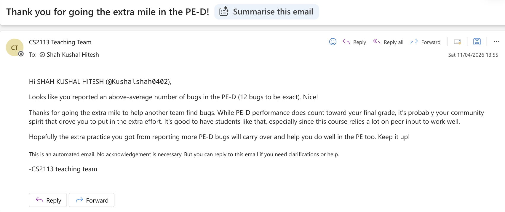

<style>
  body { font-family: -apple-system, BlinkMacSystemFont, 'Segoe UI', sans-serif; }
  .section-label { display: inline-block; font-size: 0.75rem; font-weight: 700; text-transform: uppercase; letter-spacing: 0.08em; color: #64748b; margin-bottom: 0.25rem; }
  .info-box { background: #f8fafc; border-left: 4px solid #3b82f6; padding: 0.75rem 1rem; margin: 0.75rem 0; border-radius: 0 6px 6px 0; }
  .info-box.green { border-left-color: #22c55e; }
  .info-box.amber { border-left-color: #f59e0b; }
  .info-box strong { color: #1e40af; }
  .info-box.green strong { color: #15803d; }
  .info-box.amber strong { color: #b45309; }
  .feature-card { border: 1px solid #e2e8f0; border-radius: 8px; padding: 1rem 1.25rem; margin: 1rem 0; background: #fff; }
  .badge { display: inline-block; background: #dbeafe; color: #1d4ed8; font-size: 0.7rem; font-weight: 600; padding: 2px 8px; border-radius: 999px; text-transform: uppercase; letter-spacing: 0.05em; }
  .pr-links { font-size: 0.85rem; color: #64748b; margin: 0.4rem 0; }
  h2 { border-bottom: 2px solid #e2e8f0; padding-bottom: 0.4rem; }
  h3 { color: #1e293b; }
</style>

# Shah Kushal Hitesh — Project Portfolio Page

<span class="badge">CS2113 · AY2526 S2</span>

---

## Project: FinBro

Finbro is a command-line personal finance management application designed to help users track expenses, monitor spending habits, and manage a monthly budget efficiently.

It is built using Java and follows a modular, command-based architecture, where user inputs are parsed into executable commands.

> Given below are my contributions to the project.

<div style="page-break-after: always;"></div>

---

## Core Features Implemented

### Add Expense Command

<div class="info-box">
<strong>What it does:</strong> Allows the user to record a new expense either via direct mode (single command with all parameters) or walkthrough mode (interactive prompts).
</div>

<div class="info-box green">
<strong>Justification:</strong> The dual-mode design improves usability by supporting both experienced users who prefer fast entry and new users who benefit from guided input.
</div>

**Highlights:**
- Invalid dates, non-positive and non-number amounts are all met with applicable error messages and prompts the user with the correct format
- Implementing the walkthrough mode required careful handling of sequential input validation with repeated prompts on invalid input
- The confirmation step before saving reduces accidental entries

---

### View All Command

<div class="info-box">
<strong>What it does:</strong> Retrieves all recorded expenses from the system and displays them in a structured, readable format — showing the amount, category, and date for each entry, along with a computed total expenditure at the end.
</div>

<div class="info-box green">
<strong>Justification:</strong> Users need a way to get a full overview of their spending history at a glance. Without this, there is no way to review past expenses in a single command.
</div>

**Highlights:**
- Handles the edge case where no expenses have been recorded yet, displaying an appropriate message instead of an empty or broken output
- Total expenditure is computed dynamically by iterating through the expense list, so it is always accurate and up to date
- Display logic is fully handled by `Ui` keeping `ViewCommand` focused solely on retrieving the data, which follows the separation of concerns principle

<div style="page-break-after: always;"></div>

---

### Storage Component

<div class="info-box">
<strong>What it does:</strong> Handles persistent loading and saving of expenses and budget limits to a local <code>.txt</code> file. On startup, expenses and the budget limit are loaded automatically. After every command, the updated data is saved.
</div>

<div class="info-box green">
<strong>Justification:</strong> Persistence is a core requirement — without it, all expense records would be lost every time the app closes. The storage layer ensures data survives across sessions without requiring a database.
</div>

**Highlights:**
- Implemented corruption handling — invalid or malformed lines are logged and skipped rather than crashing the app
- The budget limit is stored as the first line in a special `LIMIT | <value>` format, and is read separately before expenses are processed
- If the data file does not exist on first launch, the app gracefully creates a new one instead of throwing an error
- Amount validation is enforced during loading to prevent negative or zero values from being loaded into the system


---

## Code Contributions

**RepoSense Link:** [View detailed code contributions](https://nus-cs2113-ay2526-s2.github.io/tp-dashboard/?search=kushalshah0402&breakdown=true&sort=groupTitle%20dsc&sortWithin=title&since=2026-02-20T00%3A00%3A00&timeframe=commit&mergegroup=&groupSelect=groupByRepos&checkedFileTypes=docs~functional-code~test-code~other&filteredFileName=)

- Added JUnit tests for `AddCommand`
- Added logging and asserts for `AddCommand` and `Storage`


---

## Enhancements Implemented

### 1) Budget Limit Feedback Enhancement

<div class="info-box">
<strong>What it does:</strong> After every expense is added, the system checks the user's total spending against their set budget limit and warns them if they are close to or have exceeded it.
</div>

<div class="info-box green">
<strong>Justification:</strong> Previously, users had no immediate feedback on their budget status after adding an expense. This enhancement makes the app proactive rather than passive, helping users stay aware of their spending in real time.
</div>

<div class="pr-links">PR: <a href="https://github.com/AY2526S2-CS2113-T10-4/tp/pull/32">#32</a></div>

**Highlights:**
- Two distinct warning messages are shown depending on whether the user is approaching or has already exceeded the limit
- The exact limit amount is displayed in the warning so users know precisely what threshold they are being measured against
- Logic is cleanly separated — `Ui` handles the display while the budget checking logic lives outside of `Ui`, following separation of concerns

---

### 2) Add Expense Enhancement

<div class="info-box green">
<strong>Justification:</strong> Previously, users were able to add negative years for the date as well as only special characters for the category. However, this did not make much sense in our context. So I made sure these were not allowed and also added a double confirmation for expense amounts that were very large in case it was accidental.
</div>

<div class="pr-links">PRs: <a href="https://github.com/AY2526S2-CS2113-T10-4/tp/pull/195">#195</a>, <a href="https://github.com/AY2526S2-CS2113-T10-4/tp/pull/206">#206</a>, <a href="https://github.com/AY2526S2-CS2113-T10-4/tp/pull/193">#193</a></div>

**Highlights:**
- If amount is greater than $10,000, a second confirmation message is sent after you confirm the expense the first time, asking user to double check the amount they keyed in since it is very large
- For categories, ONLY special characters are not allowed as Category: `#%$@(&)` does not make much sense to the users
- Years before 2000 and dates after the present date are no more allowed since it is not applicable to our context

---

## Documentation Contributions

### User Guide

| Component | Pull Request |
|-----------|:------------:|
| `add` command documentation | [#64](https://github.com/AY2526S2-CS2113-T10-4/tp/pull/64) |
| `view` command documentation | [#93](https://github.com/AY2526S2-CS2113-T10-4/tp/pull/93) |

### Developer Guide

| Component | Pull Request |
|-----------|:------------:|
| Direct `add` command implementation details & UML diagram | [#92](https://github.com/AY2526S2-CS2113-T10-4/tp/pull/92) |
| `view` command implementation details & UML diagram | [#94](https://github.com/AY2526S2-CS2113-T10-4/tp/pull/94) |
| Storage component implementation details | [#96](https://github.com/AY2526S2-CS2113-T10-4/tp/pull/96) |
| Walkthrough `add` command implementation details | [#233](https://github.com/AY2526S2-CS2113-T10-4/tp/pull/233) |

---

## Team-Based Contributions

- **Repository Setup:** Set up the GitHub team organisation and repository — forked the repo and configured branch protections
- **Issue Tracking:** Enabled and configured the issue tracker with custom labels, created milestones, and added team members
- **PR Management:** Set up and configured the team PR review process
- **Build Configuration:** Configured Gradle for the project
- **Release Management:** Created the JAR file for the team demo and published the v1.0 release on GitHub
- **Developer Documentation:** Maintained developer documentation not specific to a feature — wrote the Storage component section in the Developer Guide, covering the load/save operations, file format, and design considerations
- **Fixed Bugs:** Helped in fixing bugs reported during our mock evaluation [#193](https://github.com/AY2526S2-CS2113-T10-4/tp/pull/193), [#195](https://github.com/AY2526S2-CS2113-T10-4/tp/pull/195)

---

## Community-Based Contributions

**Product Testing:** During the PE-D, tested other group's project and reported as many bugs (12) as I could find so as to allow them to fix the bugs before final submission.



<div style="page-break-after: always;"></div>

---

## Detailed Implementation Sections

### Storage Component Deep Dive

The `Storage` class is responsible for persisting expense data and the budget limit across sessions. It reads from and writes to a local `.txt` file.

#### Load Operation

When the application starts, `Storage.load()` is called:

1. If the file does not exist, an empty list is returned and a new file will be created on the next save
2. The first line is passed to `readLimit()` which checks for the `LIMIT | <value>` format and sets the budget limit via `Limit.setLimit()`
3. If the first line is not a limit entry, it is treated as an expense line instead
4. Each subsequent line is passed to `processExpenseLine()` which splits by `|` and validates the format and amount before adding to the list
5. Corrupted or malformed lines are logged and skipped without crashing the application

#### Save Operation

After every command, `Storage.save()` is called:

1. The budget limit is written first in the format `LIMIT | <value>`
2. Each expense is written in the format `amount | category | date`
3. The file and its parent directories are created automatically if they do not exist

#### File Format

The `finbro.txt` file follows this structure:

```
LIMIT | 1000.00
50.00 | food | 2026-03-01
20.00 | transport | 2026-03-02
```

#### Design Considerations

| Consideration | Rationale |
|:--------------|-----------|
| **Corruption Handling** | Malformed lines are skipped rather than throwing an exception. Ensures a single corrupted entry does not affect the rest of the data. All skipped lines are logged at WARNING or SEVERE level for debugging. |
| **Limit Stored as First Line** | Separating the limit from expense entries allows it to be read and applied before any expenses are processed. Falls back gracefully if no limit line is found. |
| **Flat File Over Database** | Keeps the application lightweight with no external dependencies. Sufficient for the scale of data this application handles. |


---

### View Expense Feature

The `ViewCommand` class is responsible for handling both modes. When executed, the command checks the argument supplied:

- If argument is `all` — all expenses are retrieved and displayed
- If argument is a category name — only matching expenses are retrieved and displayed
- If argument is empty — an error is thrown

The following diagram shows the sequence of operations for the `view` command:


<div style="page-break-after: always;"></div>

---

### Add Expense Feature

The following diagram shows the sequence of operations for the `add` command:


The following diagram shows the sequence of operations for the walkthrough method for the `add` command:


---

## User Guide Excerpts

### Add Expense Command

The `add` command lets you record a new expense in two modes:

**Direct Mode:**
```
add <amount> <category> <date>
```

**Walkthrough Mode:**
```
add
```

The system will guide you through entering the amount, category, date, and a final confirmation step.

---

### View Expenses

The `view` command displays your recorded expenses.

| Command | Function |
|:--------|----------|
| `view all` | Displays all recorded expenses |
| `view <category>` | Displays expenses under a specific category |

**Notes:**
- Categories are not case sensitive
- Running `view` without any argument will display an error message
